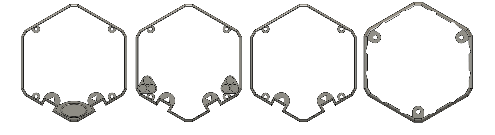

# Fusion 360 - Editable Bumper Files

### Attribution, Thanks, and Backstory. 

### 42computer 

Made the OG STL files : Located [here](https://github.com/emfcamp/badge-2024-addons/tree/main/3d-printable-case)

But after some chat on Discord- 

Where I was making a version of the Case that can have USB C power applied to it.
[Link Here](https://www.printables.com/model/947947-tildagon-tildacase-with-in-case-usb-c)

It became apparent that there was another version of the case, with bumper support.

I then realised I'd have to modify my case, to support the additional offset of the Bumpers, and went looking for them. 

I decided to import the STLs from the Source, and trace / create raw primitives inside Fusion360. 

Fusion isn't an Open Tool, But having recently tried to use OpenSCAD / FreeCAD. I will be staying with Fusion. 

I wanted to upload the root F3D file, so anyother hackers can just grab it and change it. 

Enjoy ! 
