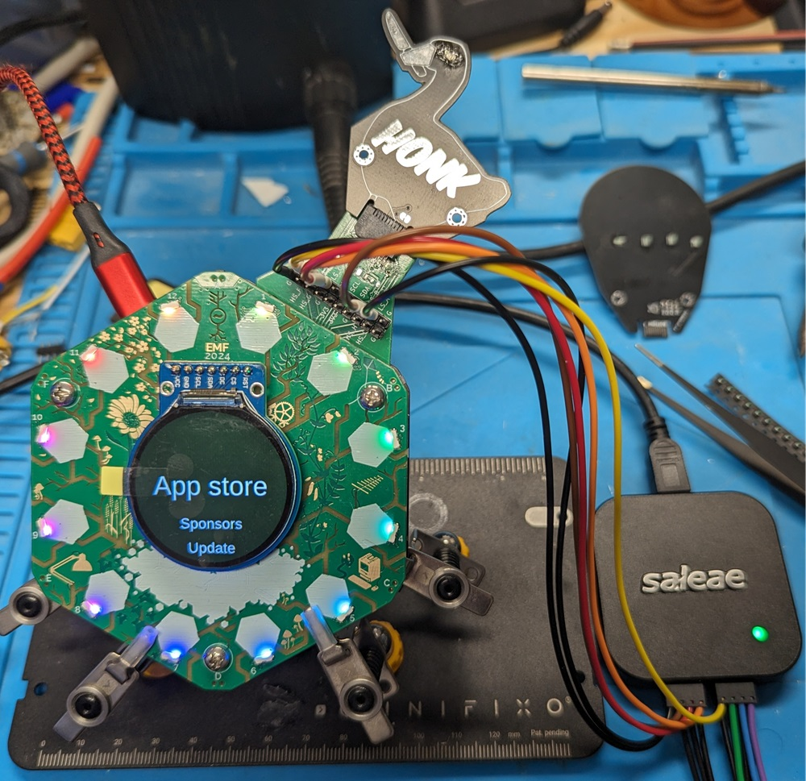
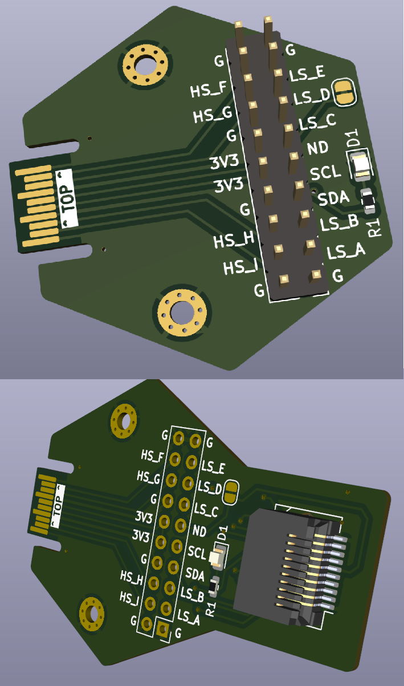

# Nightmarket Interposer

### Attribution, Thanks, and Backstory. 

Well wasn't that a fun EMF 2024 !

Massive thanks to all on the Badge Team who answered questions of mine on Matrix, and in person. 

Specifically, Matthew Wilkes and Naomi Pentrel.

Another mention to @konichiwakitty who facilitated getting me a spot in the Nightmarket. 

It was my first time selling *Anything*, Let alone my own PCB's. 

I take great pride in the fact that I've been able to get helpful debugging tools into the hands of fellow EMF Attendees. 

### Original Source 

[The Original Breakout](https://github.com/emfcamp/badge-2024-hardware/tree/main/hexpansion)

### What you can do with it.

It has 3 purposes. 

1) Online HW without a Badge. 
2) Breakout SFP from the Badge to whatever you need. 
3) Interpose comms between badge and Hexpansions. 

### PCB Issues

I am not a PCB Designer by trade, this was part of the first few PCBs I have made in a long time. 

It may very well be there are some questionable routing decisions on this PCB, or Bugs. Feel free to fork it, and improve.

