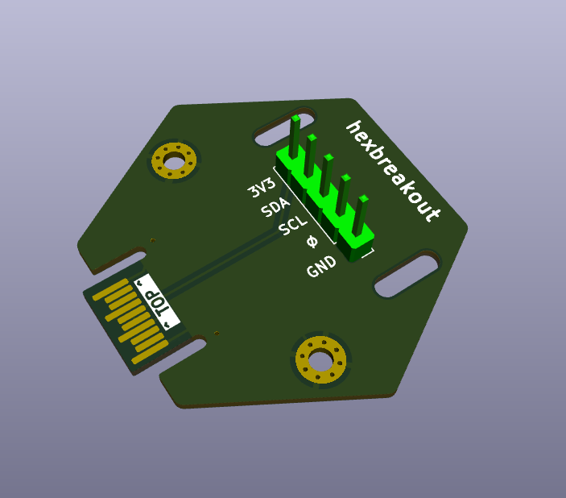

# Hexbreakout: Tildagon Hexpansion for Pimoroni Breakout Garden

This hexpansion addon is an adapter for [Pimoroni I2C Breakout Garden](https://shop.pimoroni.com/collections/electronics) boards. The source repo can be found [here](https://github.com/ab-gh/hexbreakout)

It simply connects 3v3, GND, SDA, and SCL, presenting them in the correct order for addons. It does not wire the interrupt pin. 

You can solder a 5-pin 2.54mm header pin, either vertical for short boards (BME280, SGP30) or right-angle for longer boards (MLX90640, 11x7 Matrix).

There are drilled slots for attachment holes.