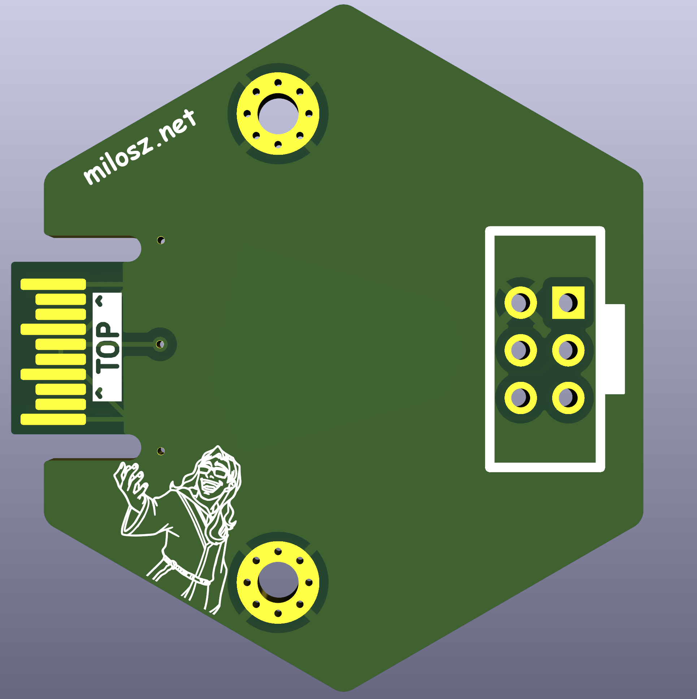
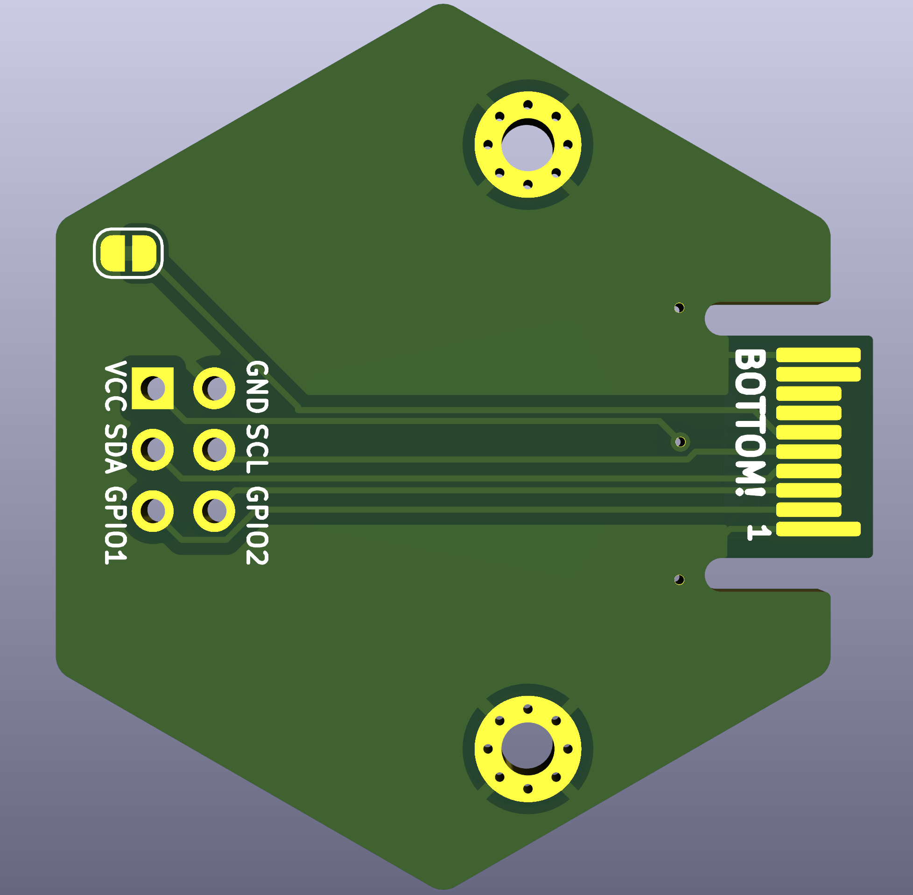

# SAOv2 / SAOv1.69bis hexpansion/hexdapter(?)

Provides power, `SDA`/`SCL` and exposes `LS_A`/`LS_B` as GPIO pins to your bog-standard [Simple Add-On](https://hackaday.io/project/175182-simple-add-ons-sao)/[Shitty Add-On](https://hackaday.com/2019/03/20/introducing-the-shitty-add-on-v1-69bis-standard/)

If everything goes to plan (does it ever?), this board should unleash the "power" of SAOs in the Tildragon.

wow!
