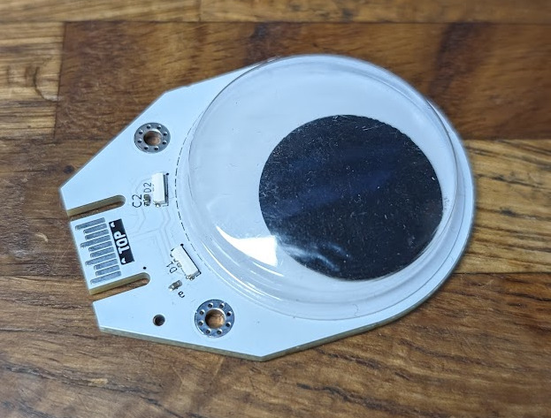
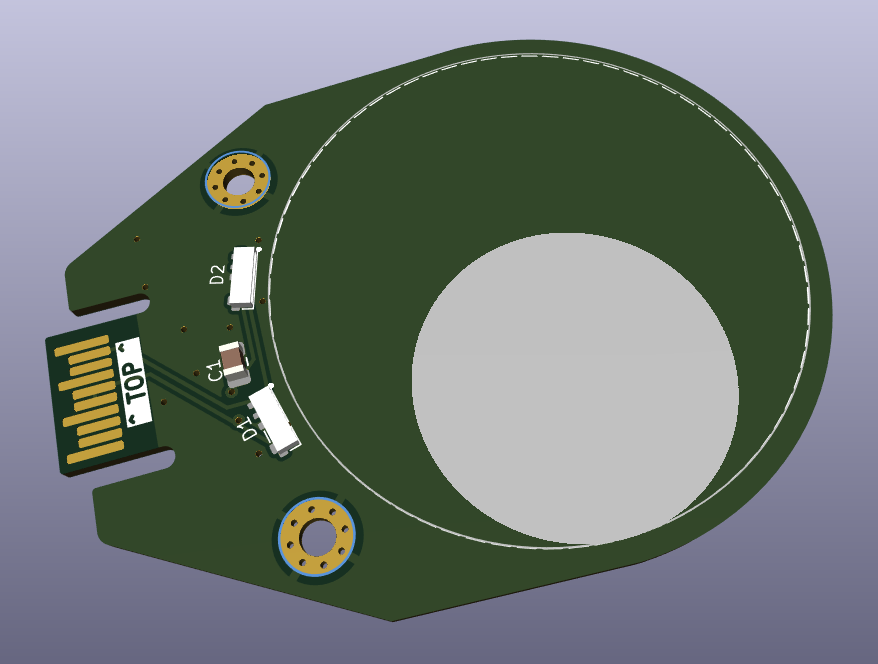

# Googly Eye Hexpansion!

Add some googly eyes to your badge.  This will work with any 35mm googly eye.

Add side-looking LEDs so you can make the eyes ANGERYY.

Heres a photo!



And here's a render!



## Some Code!

You can output to the LEDs from an app using the HS_F pin:

```python
import neopixel

np = neopixel.NeoPixel(hexpansion.HS_F, 2)
np[0] = (255,0,0)
np[1] = (255,0,0)
np.write()
```

Note i pretty much made up how talking to the pins works, as the firmware isn't that complete yet!
